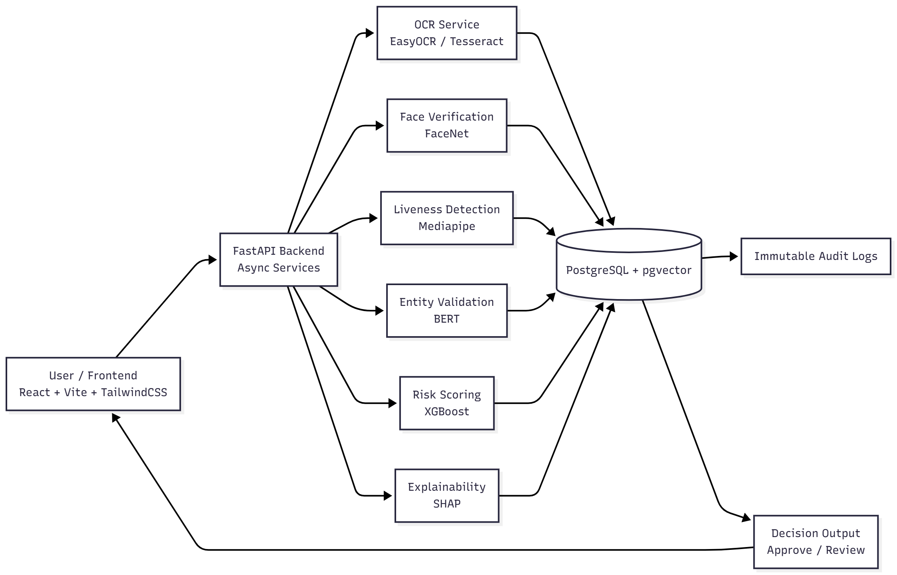

# **Problem Statement & Product Overview**

## **Background / Motivation**

Know Your Customer (KYC) is essential in the banking and financial services sector but often slow, manual, and error-prone. It involves document collection, identity verification, risk assessment, and regulatory compliance.

AI offers an opportunity to simplify and automate the entire workflow — reducing customer effort and operational load while improving accuracy and compliance.

---

## **Problem Statement**

Build an **AI-powered KYC solution** that automates and enhances the end-to-end onboarding workflow. Your system should:

* Automatically collect, verify, and extract data from customer documents (ID proofs, address proofs, etc.).
* Assess customer risk profiles and detect suspicious activities in real-time.
* Provide contextual nudges and updates for customers and staff throughout the KYC journey.

The solution must ensure **automation + compliance**, with full transparency, auditability, and security.

---

## **Key Objectives / Considerations**

### **1. Automation & Intelligence**

* AI-based auto-collection and verification of documents.
* Accurate extraction of key fields (Name, DOB, Address, ID number).
* Automated risk classification; anomaly detection; human-in-the-loop for edge cases.

### **2. User Experience**

* Real-time nudges and guided steps for users.
* Friendly feedback when documents are unclear, missing, or invalid.
* Instant approval for low-risk users where feasible.

### **3. Transparency & Compliance**

* Explainable AI for every automated decision.
* End-to-end audit trail.
* Continuous communication on application status and next steps.

### **4. Security & Fairness**

* Secure storage and encrypted handling of sensitive data.
* Bias-free model design ensuring fairness across customer segments.

---

# **Solution Overview**

* The system is built using **FastAPI** with **Python** as the backend, **PostgreSQL** with the **pgvector** extension for data and embeddings, and **React**, **Vite**, and **TailwindCSS** for a fast, responsive, and intuitive frontend. It automates the entire **KYC process** — from **document upload** to **verification** and **risk-based decisioning** — ensuring an effortless onboarding experience for customers.

* **EasyOCR** serves as the main OCR engine to extract text from **ID cards**, **utility bills**, and **address proofs**, while **Tesseract** acts as a fallback for documents with cleaner layouts. This **dual approach** improves extraction accuracy across multiple document types and reduces the dependency on any single OCR method.

* **FaceNet** is used to perform **one-to-one facial similarity checks** between the customer’s selfie and their ID photograph, ensuring **identity verification accuracy**. **Mediapipe** supports **real-time liveness detection** by analyzing **blink** or **motion cues**, preventing spoofing through static photos or videos.

* Extracted data is processed using **BERT**, which identifies and validates key entities such as **name**, **date of birth**, and **address**. This step corrects **OCR inconsistencies** and ensures that the extracted information adheres to **standardized formats** expected by financial institutions.

* **XGBoost** generates a **dynamic risk score** by combining AI features such as **document quality**, **liveness confidence**, **location anomalies**, and **behavioral patterns**. **Low-risk users** are instantly approved, while **higher-risk cases** are flagged for human review, achieving the right balance between **automation** and **compliance**.

* **SHAP** is integrated for **explainability**, providing clear visualization of which features influenced each decision. This allows compliance officers to understand why an application was **approved** or **flagged**, ensuring **transparency** and **accountability** for every AI-driven outcome.

* **Data security** and **compliance** are central to the design. All personally identifiable information is encrypted using **AES-256** at rest and **TLS 1.3** during transmission. **PostgreSQL** maintains **immutable audit logs**, ensuring every system decision is **traceable** and **auditable** in line with **AML** and **KYC regulations**.

* The backend architecture is **modular** and **asynchronous**, allowing **FastAPI** to handle multiple onboarding requests efficiently. The system runs smoothly on a **single environment** but is **container-ready** for future scaling using **Docker** or **Kubernetes**.

* The user interface offers a **guided onboarding journey** with **live feedback**, **progress tracking**, and **contextual nudges** such as “**Retake – glare detected**.” This reduces upload errors, improves completion rates, and ensures a **frictionless user experience**.

* The solution significantly improves **KYC efficiency** by automating up to **80%** of manual verification work, reducing processing costs by nearly **70%**, and cutting onboarding time from **days to minutes**. With **explainable AI**, strong **compliance**, and **scalable design**, the system delivers a **transparent**, **ethical**, and **adoption-ready KYC experience** for banks and fintech organizations worldwide.

---

# **Technology Stack**

## **Frontend**
- React
- Vite
- TailwindCSS

## **Backend**
- FastAPI (Python)
- Modular and asynchronous backend architecture

## **Database**
- PostgreSQL
- pgvector extension (for embeddings)
- Immutable audit logs stored in PostgreSQL

## **AI / ML Components**
- EasyOCR (primary OCR engine)
- Tesseract (fallback OCR)
- FaceNet (facial similarity verification)
- Mediapipe (real-time liveness detection)
- BERT (entity extraction and validation)
- XGBoost (risk scoring)
- SHAP (explainability)

## **Security**
- AES-256 encryption at rest
- TLS 1.3 encryption during transmission

## **Scalability / Deployment**
- Container-ready design for future Docker / Kubernetes scaling

---

# **System Architecture**

## **Overview**
The system follows a modular, asynchronous architecture built on FastAPI, with a modern React-based frontend and a PostgreSQL database enhanced with the pgvector extension. Each stage of the KYC pipeline — from document upload to verification and risk-based decisioning — is handled through clearly defined services to ensure scalability, transparency, and reliability.

---

## **High-Level Flow**
1. User uploads documents and selfie through the React + Vite + TailwindCSS frontend.
2. FastAPI backend receives the files and processes requests asynchronously.
3. OCR pipeline extracts text using EasyOCR, with Tesseract as a fallback.
4. FaceNet performs facial similarity checks between selfie and ID photo.
5. Mediapipe analyzes liveness through blink and motion cues.
6. BERT validates and standardizes extracted entity fields (Name, DOB, Address).
7. XGBoost computes a dynamic risk score based on multiple AI-driven signals.
8. SHAP generates explainability outputs for transparency and compliance.
9. PostgreSQL stores:
   - Raw documents
   - Cleaned data
   - Embeddings (via pgvector)
   - Risk scores
   - Immutable audit logs
10. Final decision (approve / review) is returned to the frontend, with live feedback and nudges.

---

## **Architecture Components**

### **Frontend**
- Built with React, Vite, TailwindCSS.
- Handles:
  - Document upload
  - Live feedback (e.g., "Retake – glare detected")
  - Progress tracking
  - Display of verification results

### **Backend (FastAPI)**
- Asynchronous request handling.
- Modular service layers:
  - **OCR Service** (EasyOCR + Tesseract)
  - **Face Verification Service** (FaceNet)
  - **Liveness Detection Service** (Mediapipe)
  - **Entity Validation Service** (BERT)
  - **Risk Scoring Service** (XGBoost)
  - **Explainability Service** (SHAP)
- Orchestration pipeline ensures smooth document → verification → decision flow.

### **Database Layer (PostgreSQL)**
- Stores all extracted and validated data.
- Maintains embeddings using pgvector.
- Keeps immutable audit logs for regulatory purposes.
- Tracks user submissions, verification metadata, and risk scores.

---

## **Security Layer**
- AES-256 for encryption at rest.
- TLS 1.3 for secure data transmission.
- Audit logs ensure every automated decision is traceable.
- Compliance with AML and KYC requirements through explainable, auditable workflows.

---

## **Scalability**
- Backend is fully async and optimized for concurrent onboarding flows.
- Architecture is container-ready and can be scaled using Docker or Kubernetes in future phases.
- Each AI component operates independently, allowing parallel execution and efficient resource usage.

---

## **System Architecture Diagram** 

---

# **Data Model and Storage**

## **Overview**
The system uses PostgreSQL as the central data store, enhanced with the pgvector extension to store embeddings for facial similarity, document representations, and AI-driven signals. All user data, extracted fields, risk scores, and immutable audit logs are stored securely with AES-256 encryption at rest and TLS 1.3 during transmission.

---

## **Core Entities and Tables**

### **1. Users**
Stores basic onboarding session details.

**Fields:**
- user_id (UUID, PK)
- name
- email / phone (if applicable)
- created_at
- updated_at

---

### **2. KYC Applications**
Represents each KYC attempt.

**Fields:**
- application_id (UUID, PK)
- user_id (FK → Users)
- status (pending, approved, review_required)
- submitted_at
- decision_at
- risk_score_id (FK → RiskScores)

---

### **3. Documents**
Stores uploaded user documents (ID cards, bills, proofs).

**Fields:**
- document_id (UUID, PK)
- application_id (FK)
- document_type (ID Card, Utility Bill, Address Proof)
- raw_file_path (encrypted storage)
- extracted_text (JSON)
- ocr_confidence
- created_at

---

### **4. Embeddings (pgvector)**
Stores embeddings generated from FaceNet, document vectors, and other ML components.

**Fields:**
- embedding_id (UUID, PK)
- application_id (FK)
- vector (pgvector)
- embedding_type (face, id_photo, text_embedding)
- created_at

---

### **5. RiskScores**
Holds XGBoost risk scoring results.

**Fields:**
- risk_score_id (UUID, PK)
- application_id (FK)
- score_value (float)
- feature_map (JSON of features fed into model)
- created_at

---

### **6. Explainability**
Stores SHAP explainability outputs for compliance.

**Fields:**
- explain_id (UUID, PK)
- application_id (FK)
- shap_summary (JSON)
- created_at

---

### **7. AuditLogs (Immutable)**
Tracks every system-level decision and update to maintain compliance.

**Fields:**
- log_id (UUID, PK)
- application_id (FK)
- action_type (OCR_EXTRACTED, FACE_MATCHED, RISK_CALCULATED, DECISION_MADE)
- action_details (JSON)
- timestamp (immutable)
- actor (system or reviewer)

---

## **Storage Strategy**

### **1. Document Storage**
- Raw images stored encrypted (AES-256)
- Paths stored in `Documents.raw_file_path`

### **2. Embedding Storage (pgvector)**
- Face embeddings → used for ID–selfie similarity  
- Text embeddings → for identity info consistency checks  
- Stored using PostgreSQL pgvector extension

### **3. Audit Trail Storage**
- Stored in a **write-once** manner
- Ensures regulatory compliance for AML/KYC

### **4. Structured + Semi-Structured Data**
- Core fields: in normalized relational tables
- Extracted text & SHAP: stored as JSONB for flexibility

---

## **Data Flow Summary**
1. User uploads documents → stored encrypted.
2. OCR (EasyOCR/Tesseract) extracts text → saved in `Documents`.
3. FaceNet & Mediapipe generate embeddings → saved in `Embeddings`.
4. BERT validates extracted entities → updated in `KYC Applications`.
5. XGBoost computes risk → stored in `RiskScores`.
6. SHAP outputs → stored in `Explainability`.
7. All steps logged in `AuditLogs`.

---

# **AI / ML / Automation Components**

## **Overview**
The system uses a multi-stage AI pipeline to automate the entire KYC verification workflow — from text extraction and identity verification to risk scoring and explainability. Each component operates independently but integrates seamlessly within the FastAPI backend to ensure accuracy, transparency, and compliance.

---

## **1. OCR Pipeline (Document Text Extraction)**

### **EasyOCR**
- Primary OCR engine.
- Used for extracting text from:
  - ID cards
  - Utility bills
  - Address proofs
- Handles complex layouts and noisy documents.

### **Tesseract**
- Fallback OCR engine.
- Activated for documents with cleaner, more structured layouts.
- Ensures a dual-OCR strategy that improves overall extraction accuracy.

---

## **2. Face Verification & Liveness Detection**

### **FaceNet**
- Performs **one-to-one facial similarity checks**.
- Compares the customer's selfie with the photo extracted from their ID.
- Ensures high identity verification accuracy through embeddings.

### **Mediapipe Liveness**
- Real-time liveness detection.
- Detects **blink patterns**, **facial motion**, and **live depth cues**.
- Prevents spoofing using printed photos, screens, or static images.

---

## **3. Entity Extraction & Validation**

### **BERT**
- Processes OCR output to extract and validate:
  - Name  
  - Date of Birth  
  - Address  
- Corrects OCR inconsistencies.
- Standardizes fields to comply with financial institution formats.

---

## **4. Risk Scoring Engine**

### **XGBoost**
- Generates a **dynamic risk score** using features such as:
  - Document clarity
  - Liveness confidence
  - Location anomalies
  - Behavioral patterns
- Automatically approves low-risk users.
- Flags medium/high-risk users for manual review.

---

## **5. Explainability Layer**

### **SHAP**
- Provides clear explanations for every risk decision.
- Visualizes:
  - Key positive factors influencing approval.
  - Key negative factors leading to flags.
- Ensures transparency and auditability for compliance teams.

---

## **6. Automation Workflow**

- The AI pipeline runs fully automatically once documents are uploaded.
- Each module operates as an isolated service:
  1. OCR extraction  
  2. Face match  
  3. Liveness check  
  4. Entity validation  
  5. Risk scoring  
  6. Explainability generation  
- FastAPI orchestrates these steps asynchronously.
- Outputs feed into PostgreSQL for storage, audit logging, and downstream decisioning.

---

# **Security and Compliance**

## **Overview**
Security and regulatory compliance are core to the system's design. All user data, processing steps, and automated decisions follow strict KYC and AML requirements. The platform ensures encrypted handling of sensitive information, transparent decision-making, and immutable audit trails for full accountability.

---

## **1. Data Security**

### **AES-256 Encryption (At Rest)**
- All personally identifiable information (PII) stored in PostgreSQL is encrypted using **AES-256**.
- Ensures protection against unauthorized access, storage breaches, or insider threats.

### **TLS 1.3 Encryption (In Transit)**
- All communication between frontend ↔ backend ↔ database is secured using **TLS 1.3**.
- Prevents interception, tampering, and man-in-the-middle attacks.

---

## **2. Compliance & Regulatory Alignment**

### **AML / KYC Compliance**
- Every automated action (OCR, face match, risk scoring) is logged.
- Ensures decisions are **traceable**, **explainable**, and **auditable**.

### **Explainable AI (SHAP)**
- SHAP provides feature-level insights for every risk decision.
- Compliance officers can view:
  - Why a user was approved
  - Why a case was flagged for review
- Supports regulatory requirements for **fairness**, **transparency**, and **non-discrimination**.

### **Standardized Identity Data**
- BERT standardizes key fields such as **Name**, **DOB**, and **Address**.
- Maintains compliance with financial institution verification rules.

---

## **3. Auditability**

### **Immutable Audit Logs**
- PostgreSQL stores a tamper-proof history of:
  - OCR extraction outputs
  - Selfie–ID match results
  - Liveness detection signals
  - Risk scores
  - Final decisions
- Ensures full traceability for internal audits, regulatory checks, and dispute resolution.

---

## **4. Fairness & Ethical AI**

### **Balanced Automation**
- Low-risk users are auto-approved.
- High-risk or ambiguous cases are routed to manual review.
- Prevents over-reliance on automated decisioning.

### **Bias Reduction**
- Dual OCR approach reduces bias from document quality.
- Liveness verification prevents spoofing while maintaining accessibility.

---

## **5. Platform Integrity**

### **Modular, Asynchronous Backend**
- FastAPI architecture isolates each AI module:
  - OCR
  - Face verification
  - Liveness detection
  - Entity validation
  - Risk scoring
- Ensures secure and predictable execution of every verification stage.

### **Container-Ready Design**
- System is ready for secure deployment using Docker/Kubernetes (future scaling).
- Enables safe isolation of services and controlled resource usage.

---

# **Scalability and Performance**

## **Overview**
The system is designed with a modular and asynchronous FastAPI backend, enabling smooth handling of multiple KYC onboarding flows simultaneously. While deployed in a single environment, the architecture is built to scale horizontally and adapt to container-based deployment in the future.

---

## **1. Backend Scalability**

### **Asynchronous FastAPI Architecture**
- Each request—document upload, OCR extraction, face verification, liveness detection, or risk scoring—is processed asynchronously.
- Allows concurrent execution of multiple onboarding sessions without blocking.
- Supports high-throughput environments where many customers submit KYC applications simultaneously.

### **Modular Service Structure**
- OCR, face match, liveness detection, entity validation, and risk scoring are independent modules.
- Components can scale individually based on load.
- Reduces system bottlenecks and improves reliability.

### **Container-Ready Design**
- Though deployed in a single system, the architecture is **Docker/Kubernetes-ready**.
- Enables future horizontal scaling:
  - Multiple OCR containers
  - Separate face verification and liveness services
  - Dedicated risk scoring workers

---

## **2. Performance Optimization**

### **Efficient Document Processing Pipeline**
- EasyOCR handles heavy document extraction workloads.
- Tesseract activates only when needed, reducing unnecessary compute time.
- Minimizes average processing latency per document.

### **Optimized Identity Verification**
- FaceNet generates embeddings quickly for selfie–ID match comparisons.
- Embeddings stored in PostgreSQL + pgvector allow fast retrieval and vector similarity operations.
- Liveness detection runs lightweight Mediapipe models for real-time processing.

### **Entity Validation & Risk Scoring**
- BERT processes extracted text to ensure accurate entity formats.
- XGBoost runs fast inference to return risk scores with minimal latency.

---

## **3. Database Performance**

### **pgvector Acceleration**
- Vector-based searches (e.g., facial similarity) are optimized through pgvector.
- Ensures low-latency queries for identity verification.

### **Optimized Storage**
- Audit logs, extracted fields, embeddings, and scores organized into logical tables.
- JSONB fields used where flexibility is required without affecting performance.

### **Concurrent Access**
- PostgreSQL handles multiple read/write operations efficiently during peak onboarding windows.

---

## **4. User Experience Performance**

### **Real-Time Feedback**
- Frontend provides instant nudges such as:
  - "Retake – glare detected"
  - "Document unclear"
- Reduces repeated uploads and speeds up overall onboarding completion.

### **Smooth Completion Flow**
- Average onboarding time reduced from days to minutes.
- Up to **80%** of verification steps automated.
- Processing costs reduced by almost **70%**, improving system efficiency.

---

## **5. Future Scaling Potential**

- Microservices can be containerized for isolated resource allocation.
- OCR, FaceNet, and XGBoost services can be parallelized.
- Load balancers can distribute onboarding requests evenly.
- PostgreSQL can be horizontally scaled with read replicas.

The current architecture ensures reliable performance while providing a clear roadmap for production-grade scalability.

---